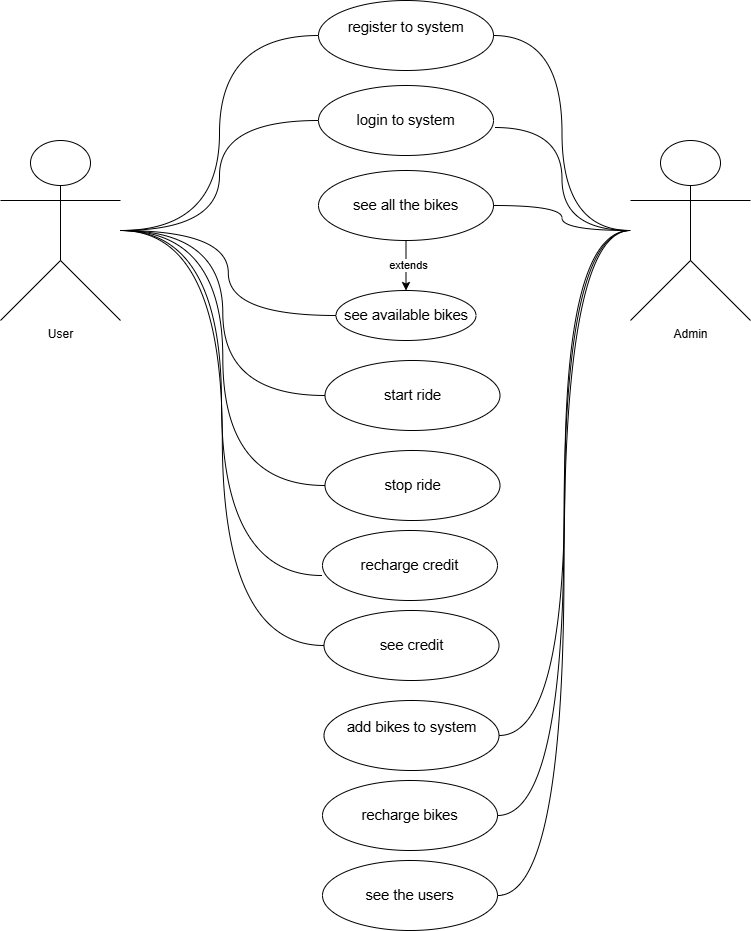
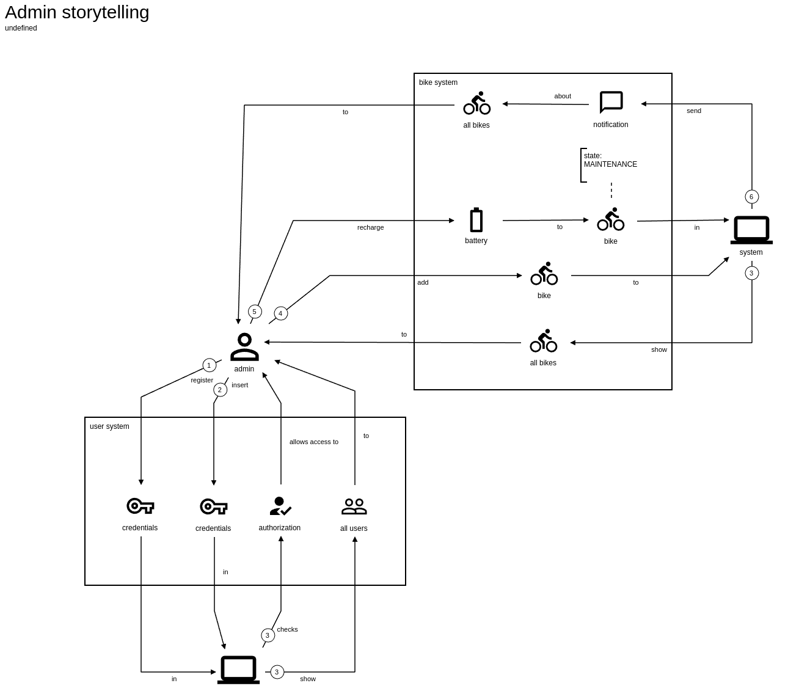
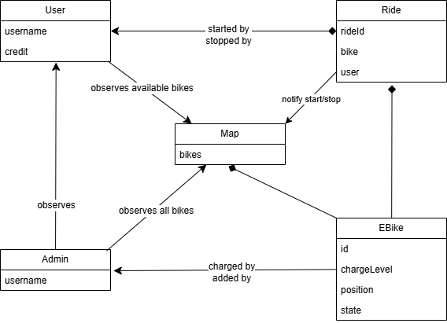
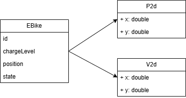
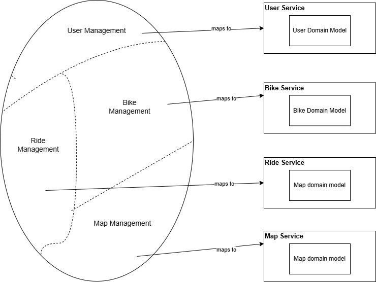
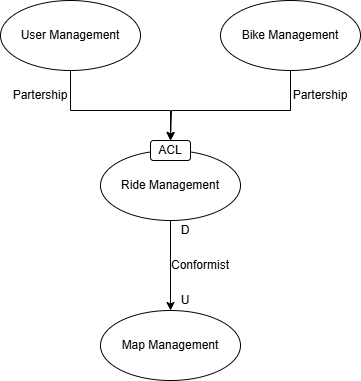

Il sistema è stato progettato seguendo il paradigma DDD (Domain Driven Design),
partendo dalla definizione dell' Ubiquitous Language e dall'analisi delle user story prodotte e dei casi d'uso, proseguendo
con la costruzione del domain-model individuato. Con questi elementi è stato possibile definire i bounded context, con i relativi subdomains, e la context map.

=== Ubiquitous Language

L'uqibuitous language è stato definito in modo da rendere il sistema comprensibile e utilizzato per
la definizione degli artefatti utili per definire: funzionalità, attributi di qualità, bounded context e context map.

[cols="1,1", options="header"]
|===
|Termine |Descrizione
|Admin |Un individuo che può registrarsi, accedere, con privilegi speciali che può gestire biciclette,
visualizza tutti gli utenti registrati e monitora lo stato e la posizione di tutte le bici sulla mappa.
|User |Un individuo che può registrarsi, accedere, visualizzare le biciclette disponibili, avviare e interrompere le corse,
ricaricare il credito del proprio account e visualizzare il saldo del credito.
|Credit |Il saldo di un utente che può essere utilizzato per avviare una corsa.
|E-Bike |Una bici elettrica che può avere stati diversi a seconda del livello della batteria e dell'utilizzo.
|Ride | Una sessione in cui un utente utilizza una bicicletta per un periodo specifico.
|Map | Una rappresentazione dell'area in cui si trovano tutte le biciclette. La mappa mostra entrambi
bici disponibili e non disponibili per gli amministratori ma solo bici disponibili per gli utenti.
|===

=== User Story

Le user story sono state definite in modo da rappresentare le funzionalità principali del sistema. Quelle individuate sono
descritte di seguito:

[cols="1,1", options="header"]
|===
|User Story |Descrizione
|US1: Sign Up | *Given* a user and an admin +
*When* a user or an admin _sign up_ +
*Then* they are saved into the system and the user credit is set to 100
|US2: Login | *Given* a user and an admin +
*When* a user or an admin _sign in_ +
*Then* they can access to the system
|US3: See All Bikes | *Given* an admin +
*When* is logged into the system +
*Then* he can view all the bikes on the map, also the riding ones
|US4: Add E-Bike | *Given* an admin and the map and an e-bike +
*When* the admin _adds_ a new e-bike +
*Then* the e-bike is saved and assigned to the map with 100% of charge level and is set to AVAILABLE state
|US5: Recharge E-Bike | *Given* an admin and the map and an e-bike +
*When* the admin _recharges_ the e-bike that is in MAINTENANCE state +
*Then* the e-bike's charging level is raised to 100% and is set to AVAILABLE state
|US6: See All Users | *Given* an admin and the list of the users registered +
*When* the admin is logged into the system +
*Then* all the registered users are shown with their credit
|US7: See All Available Bikes | *Given* a user +
*When* is logged into the system +
*Then* he can view all the bikes on the map that are in AVAILABLE state
|US8: Start Ride | *Given* a user and the map and an e-bike +
*When* the user _starts_ a new ride with the e-bike +
*Then* the e-bike is set to IN_USE state +
and the user's credit is decreased +
and the e-bike's battery level is decreased +
and the e-bike position is updated on the map following the ride +
and the map is updated following the e-bike position
|US9: Stop Ride | *Given* a user and the map and an e-bike and an ongoing ride +
*When* the user _stops_ the ride +
*Then* the e-bike change its state into AVAILABLE or MAINTENANCE depending on battery level +
and the map is updated following the bike position
|US10: Observe Ride | *Given* a user and the map and a ride +
*When* the ride is ongoing +
*Then* the user can see the e-bike of the ride on the map
|US11: Recharge Credit | *Given* a user +
*When* the user _recharges_ his credit of an amount +
*Then* the user's credit is increased of the amount
|===

=== Use Case

I casi d'uso sono stati definiti in modo da rappresentare le interazioni tra gli attori e il sistema.
Quelli individuati sono raffigurati di seguito:

==== Descrizione dei casi d'uso

**Register to system**

[cols="2,3", options="header"]
|===
| Campo           | Descrizione

| Attori          | User, Admin
| Scope           | E-Bike System
| Livello         | Alto
| Precondizioni   | L'utente non deve essere già registrato al sistema.
| Postcondizioni  | L'utente è registrato e può effettuare il login.
| Trigger         | L'utente desidera utilizzare il sistema e avvia la registrazione.
| Flusso   | 1. L'utente inserisce i propri dati +
2. Il sistema verifica i dati. +
3. Il sistema crea un nuovo account per l'utente. +
4. L'utente riceve una conferma della registrazione.
|===

**Login to system**

[cols="2,3", options="header"]
|===
| Campo           | Descrizione

| Attori          | User, Admin
| Scope           | E-Bike System
| Livello         | Alto
| Precondizioni   | L'utente deve essere registrato al sistema.
| Postcondizioni  | L'utente ha effettuato l'accesso e può utilizzare le funzionalità.
| Trigger         | L'utente desidera accedere al sistema.
| Flusso   | 1. L'utente inserisce le proprie credenziali +
2. Il sistema verifica le credenziali. +
3. Il sistema consente l'accesso e mostra la dashboard.
|===

**See all bikes**

[cols="2,3", options="header"]
|===
| Campo           | Descrizione

| Attori          | Admin
| Scope           | E-Bike System
| Livello         | Medio
| Precondizioni   | L'attore deve essere autenticato.
| Postcondizioni  | L'attore visualizza tutte le e-bike.
| Trigger         | L'attore desidera vedere tutte le e-bike.
| Flusso  | 1. L'attore esegue l'autenticazione. +
2. Il sistema recupera le e-bike. +
3. Il sistema mostra tutte le e-bike sulla dashboard.
|===

**See available bikes**

[cols="2,3", options="header"]
|===
| Campo           | Descrizione

| Attori          | User
| Scope           | E-Bike System
| Livello         | Medio
| Precondizioni   | L'attore deve essere autenticato.
| Postcondizioni  | L'attore visualizza solo le e-bike disponibili.
| Trigger         | L'attore desidera vedere le e-bike disponibili.
| Flusso  | 1. L'attore effettua l'autenticazione. +
2. Il sistema filtra le e-bike attualmente disponibili. +
3. Il sistema mostra le e-bike disponibili sulla dashboard.
|===

**Start ride**

[cols="2,3", options="header"]
|===
| Campo           | Descrizione

| Attori          | User
| Scope           | E-Bike System
| Livello         | Alto
| Precondizioni   | L'utente deve avere credito sufficiente e selezionare una bicicletta disponibile.
| Postcondizioni  | La ride viene avviata e il sistema registra l'utilizzo.
| Trigger         | L'utente decide di iniziare una ride.
| Flusso  | 1. L'utente seleziona una e-bike disponibile. +
2. Il sistema verifica il credito dell'utente. +
3. Il sistema sblocca l'e-bike. +
4. La ride inizia e viene registrata nel sistema. +
5. Il sistema aggiorna la posizione della bicicletta sulla mappa. +
6. Il sistema aggiorna il livello di carica della bicicletta. +
7. Il sistema scala il costo dal credito dell'utente.
|===

**Stop ride**

[cols="2,3", options="header"]
|===
| Campo           | Descrizione

| Attori          | User
| Scope           | E-Bike System
| Livello         | Alto
| Precondizioni   | Una ride deve essere in corso.
| Postcondizioni  | La ride viene terminata e il sistema calcola il costo.
| Trigger         | L'utente decide di terminare la ride.
| Flusso   | 1. L'utente segnala il termine della ride. +
2. Il sistema termina di scalare il credito dell'utente. +
3. Il sistema mostra l'ultimo aggiornamento della posizione dell'e-bike sulla mappa. +
4. Il sistema mostra l'ultimo aggiornamento della carica dell'e-bike: +
4.1 Se la carica è 0%, l'e-bike' viene messa in manutenzione. +
4.2 Altrimenti, l'e-bike' viene rimessa disponibile e mostrata sulla mappa.
|===

**Recharge credit**

[cols="2,3", options="header"]
|===
| Campo           | Descrizione

| Attori          | User
| Scope           | E-Bike System
| Livello         | Alto
| Precondizioni   | L'utente deve essere autenticato.
| Postcondizioni  | Il credito dell'utente viene incrementato.
| Trigger         | L'utente desidera ricaricare il proprio credito.
| Flusso   | 1. L'utente sceglie l'opzione per ricaricare il credito. +
2. L'utente specifica l'importo da ricaricare. +
3. Il sistema aggiunge l'importo specificato dall'utente al credito corrente. +
4. Il sistema aggiorna il saldo dell'utente.
|===

**See credit**

[cols="2,3", options="header"]
|===
| Campo           | Descrizione

| Attori          | User
| Scope           | E-Bike System
| Livello         | Basso
| Precondizioni   | L'utente deve essere autenticato.
| Postcondizioni  | L'utente visualizza il saldo del proprio account.
| Trigger         | L'utente desidera vedere il proprio credito.
| Flusso   | 1. L'utente accede effettua l'autenticazione. +
2. Il sistema recupera il saldo dal database. +
3. Il sistema mostra il saldo all'utente sulla dashboard.
|===

**Add bikes to system**

[cols="2,3", options="header"]
|===
| Campo           | Descrizione

| Attori          | Admin
| Scope           | E-Bike System
| Livello         | Alto
| Precondizioni   | L'amministratore deve essere autenticato.
| Postcondizioni  | Nuove e-bike sono aggiunte al sistema.
| Trigger         | L'amministratore desidera aggiungere delle nuove e-bike.
| Flusso  | 1. L'amministratore seleziona l'opzione per aggiungere le e-bike. +
2. L'amministratore inserisce i dettagli delle e-bike. +
3. Il sistema registra le e-bike nel database. +
4. Le e-bike diventano disponibili nel sistema.
|===

**Recharge bikes**

[cols="2,3", options="header"]
|===
| Campo           | Descrizione

| Attori          | Admin
| Scope           | Bike Sharing System
| Livello         | Basso
| Precondizioni   | Le e-bike devono essere in stato di manutenzione.
| Postcondizioni  | Le e-bike sono ricaricate e rimesse in stato disponibile.
| Trigger         | L'amministratore rileva e-bike scariche in stato di manutenzione.
| Flusso   | 1. L'amministratore individua e-bike scariche in stato di manutenzione. +
2. L'amministratore seleziona l'opzione di rivarica dell'e e-bike. +
3. L'amministratore specifica l'e-bike da ricaricare.
4. Il sistema aggiorna il livello di carica dell'e-bike e la rende disponibile.
|===

**See the users**

[cols="2,3", options="header"]
|===
| Campo           | Descrizione

| Attori          | Admin
| Scope           | E-Bike System
| Livello         | Basso
| Precondizioni   | L'amministratore deve essere autenticato.
| Postcondizioni  | L'amministratore visualizza l'elenco degli utenti.
| Trigger         | L'amministratore desidera vedere gli utenti registrati.
| Flusso basico   | 1. L'amministratore effettua l'autenticazione. +
2. Il sistema recupera l'elenco degli utenti e le loro relative informazioni dal database. +
3. L'elenco degli utenti con le loro relative informazioni viene mostrato all'amministratore nella dashboard.
|===

=== Domain Storytelling
In aiuto alla definizione del domain-model, si è deciso di realizzare anche dei Domain Storytelling
sia per lo user sia per l'admin.

image::../png/user_storytelling.png[]

=== Domain Model

Grazie all'analisi delle user story, dei casi d'uso e dei rispettivi Domain Storytelling è stato possibile individuare facilmente il domain-model del sistema,
definito in modo da rappresentare le entità principali del sistema e le relazioni tra di esse.
Esso è rappresentato nel seguente diagramma:

**Entità: User**

[cols="2,3", options="header"]
|===
| Campo         | Descrizione

| Nome          | User
| Attributi     | username, credit
| Ruolo         | Utente normale che può osservare le e-bike, ricaricare il proprio credito e effettuare le ride.
|===

**Entità: Admin**

[cols="2,3", options="header"]
|===
| Campo         | Descrizione

| Nome          | Admin
| Attributi     | username
| Ruolo         | Amministratore che gestisce le e-bike, aggiungendone nuove o ricaricando quelle esistenti,
e che osserva gli utenti.
|===

**Entità: Ride**

[cols="2,3", options="header"]
|===
| Campo         | Descrizione

| Nome          | Ride
| Attributi     | rideId, bike, user
| Ruolo         | Rappresenta una corsa di un utente su una bicicletta.
|===

**Entità: Map**

[cols="2,3", options="header"]
|===
| Campo         | Descrizione

| Nome          | Map
| Attributi     | bikes
| Ruolo         | Contiene informazioni sulle e-bike disponibili per gli utenti e di tutte le e-bike per l'admin.
|===

**Entità: EBike**

[cols="2,3", options="header"]
|===
| Campo         | Descrizione

| Nome          | EBike
| Attributi     | id, chargeLevel, position, state
| Ruolo         | Rappresenta una e-bike con variabili di stato.
|===

**Interazioni tra le entità**

- **User** può avviare e fermare una **Ride**.
- **Admin** può aggiungere o modificare una **EBike**.
- **User** e **Admin** possono osservare le biciclette disponibili nella **Map**.
- **Ride** notifica lo stato di avvio e fermo delle ride alla **Map**.

**Value Objects**

- **P2d**: rappresenta una posizione bidimensionale e contiene i valori x e y.
- **V2d**: rappresenta un vettore bidimensionale e contiene i valori x e y.

**Aggregates**

- **Ride**: contiene le informazioni relative alla ride e include **User** e **EBike**.
- **Map**: contiene le informazioni relative alla mappa e include **EBike**.
- **EBike**: contiene le informazioni relative alla e-bike e include i value objects **P2d** e **V2d**.

**Domain Events**

- **RideStarted**: notifica l'avvio di una ride e contiene l'aggregato **Ride**.
- **RideStopped**: notifica la fine di una ride e contiene l'aggregato **Ride**.
- **EBikeAdded**: notifica l'aggiunta di una e-bike e contiene l'aggregato **Map**.
- **EBikeRecharged**: notifica la ricarica di una e-bike e contiene l'aggregato **Map**.

**Domain Services**

- **RideService**: contiene i metodi per avviare e fermare una ride.
- **EBikeService**: contiene i metodi per aggiungere e ricaricare una e-bike.
- **MapService**: contiene i metodi per visualizzare le e-bike sulla mappa.
- **UserService**: contiene i metodi per ricaricare il credito dell'utente.

**Factory**

- **RideFactory**: contiene il metodo per creare nuove istanze ride.
- **EBikeFactory**: contiene il metodo per creare nuove istanze e-bike.
- **UserFactory**: contiene il metodo per creare nuove istanze utente.

**Repository**

- **RideRepository**: gestisce la persistenza delle ride.
- **EBikeRepository**: gestisce la persistenza delle e-bike.
- **UserRepository**: gestisce la persistenza degli utenti.

=== Bounded Context

Dall'analisi del domain-model si è potuto definire i bounded context del sistema, individuando quattro contesti ben distinti:

- **User Management Context**: di tipo _**core**_, contiene le entità e i servizi relativi agli utenti, sia admin che user.
- **Ride Management Context**: di tipo _**core**_, contiene le entità e i servizi relativi alle ride.
- **EBike Management Context**: di tipo _**core**_, contiene le entità e i servizi relativi alle e-bike.
- **Map Management Context**: di tipo _**core**_, contiene le entità e i servizi relativi alla mappa.

=== Context Map

Dall'analisi dei bounded context si è potuto definire il context map del sistema, individuando le relazioni tra i contesti:

