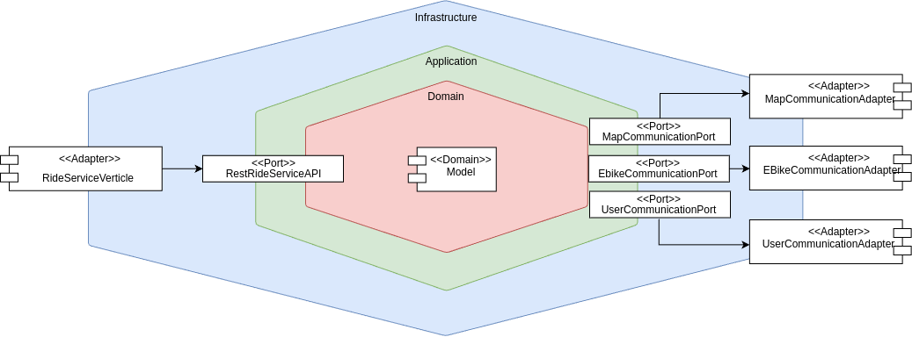

=== Ride Microservice

Il microservizio, organizzato in architettura esagonale, definisce quattro porte per interfacciarsi al layer di applicazione.
Queste porte sono utilizzate nel layer infrastrutturale, che fornisce le implementazioni concrete per interagire con la repository, pubblicare eventi,
registrare il microservizio al Service Discovery e gestire le richieste REST.
Di seguito un immagine che ne descrive la struttura (Si specifica che il sistema di event publisher è stato non rappresentato per dare maggior enfasi
all'interazione tra porte e adattatori riferiti al funzionamento della ride).

==== Domain Layer

Il domain layer di Ride Microservice, essendo un aggregato come visto nel capitolo 1, è composto dalle entità di e-bike e di user, già descritte in precedenza, più le seguenti:

* **Ride**: Rappresenta una corsa all'interno del sistema. Contiene attributi come `id` per identificare la corsa, `user` per identificare l'utente, `ebike` per identificare l'e-bike, `startTime` per indicare il tempo di inizio,
`endTime` per indicare il tempo di fine e `ongoing`, un booleano per indicare lo stato della ride.
Include i metodi per accedere a tali attributi e per gestire l'inizio e la fine della corsa, modificando gli attributi.

* **RideRepository**: interfaccia che definisce i metodi per gestire le operazioni di persistenza delle corse. Questi metodi includono l'aggiunta, la rimozione e il recupero delle corse, nonché il recupero delle simulazioni
di corse tramite l'identificativo della corsa o dell'utente.

* **RideRepositoryImpl**: implementa l'interfaccia RideRepository utilizzando una struttura dati concorrente per gestire le corse. Essa utilizza una collezione concorrente di simulazioni di corse e un'istanza di Vertx per gestire
il ciclo di vita delle simulazioni. I metodi implementati includono l'aggiunta, la rimozione e il recupero delle corse e delle simulazioni di corse.

* **RideSimulation**: gestisce la simulazione di una corsa, aggiornando periodicamente lo stato dell'ebike e dell'utente. Essa contiene un'istanza di Ride, un EventPublisher per pubblicare aggiornamenti, e un'istanza di Vertx per gestire
il ciclo di vita della simulazione. La classe fornisce metodi per avviare, aggiornare e completare la simulazione, oltre a metodi per fermare la simulazione manualmente o automaticamente quando la batteria dell'ebike o il credito dell'utente si esauriscono.

Inoltre sono definite le classi `Ebike` e `User` che rappresentano rispettivamente una ebike e un utente all'interno del sistema, ma adattate al dominio specifico della ride.
A supporto di esse sono state introdotte inoltre le classi `EbikeState` e `P2d` e `V2d`.

==== Application Layer

**RestRideServiceAPI**

La porta definisce i metodi principali per gestire le corse. Include metodi per avviare una corsa e per fermare una corsa, entrambi implementati in modo asincrono.
Questa interfaccia facilita la comunicazione tra il sistema delle corse e i client esterni, consentendo un'interazione fluida e uno scambio di dati.

**EBikeCommunicationPort**

La porta definisce i metodi per comunicare con l'ebike microservice. Include metodi per inviare aggiornamenti sulle ebike, recuperare informazioni su una specifica ebike, e inizializzare la comunicazione.
Questi metodi sono fondamentali per mantenere il sistema e il microservizio delle ebike informati sugli aggiornamenti in tempo reale.

**MapCommunicationPort**

La porta gestisce la comunicazione con il Map Microservice. Fornisce metodi per notificare l'inizio e la fine di una corsa, oltre a un metodo per inizializzare la comunicazione.
Questi metodi sono fondamentali per mantenere il sistema e il microservizio delle mappe informati sugli aggiornamenti in tempo reale.

**UserCommunicationPort**

La porta definisce i metodi per comunicare con l'user microservice. Include metodi per inviare aggiornamenti sugli utenti, recuperare informazioni su un utente specifico, e inizializzare la comunicazione.
Questi metodi sono fondamentali per mantenere il sistema e il microservizio degli utenti informati sugli aggiornamenti in tempo reale.

**EventPublisher**

La porta è progettata per gestire la pubblicazione di aggiornamenti relativi agli utenti e alle ebike coinvolti in una `RideSimulation`.

**RestRideServiceAPIImpl**

La classe implementa l'interfaccia RestRideServiceAPI e fornisce l'implementazione concreta dei metodi per gestire le corse. Questa classe utilizza le porte definite sopra per interagire
con i microservizi delle ebike, delle mappe e degli utenti.
Tale classe è il cuore dell'application layer del microservizio delle corse, orchestrando le interazioni tra i vari microservizi e gestendo la logica di business relativa alle corse.

==== Infrastructure Layer

**EBikeCommunicationAdapter**

L'adapter implementa l'interfaccia EbikeCommunicationPort e gestisce la comunicazione con il microservizio delle ebike. Utilizza un WebClient per inviare richieste HTTP al microservizio delle ebike
e include metodi per la registrazione per ricevere aggiornamenti sulle ebike tramite EventBus, l'invio degli aggiornamenti sulle ebike e il recupero delle informazioni di una specifica ebike inviando una richiesta HTTP.

**MapCommunicationAdapter**

L'adapter implementa l'interfaccia MapCommunicationPort e gestisce la comunicazione con il microservizio delle mappe. Include metodi per
la registrazione per ricevere aggiornamenti sulle mappe e la notifica dell'inizio e della fine di una corsa.

**UserCommunicationAdapter**

L'adapter implementa l'interfaccia UserCommunicationPort e gestisce la comunicazione con il microservizio degli utenti. Include metodi per
la registrazione per ricevere aggiornamenti sugli utenti tramite EventBus, l'invio degli aggiornamenti sugli utenti e il recupero delle informazioni di uno specifico utente inviando una richiesta HTTP.

**RideServiceVerticle**

Il verticle rappresenta il punto di ingresso del Ride Microservice. Configura un server HTTP utilizzando Vert.x e definisce le rotte per gestire le richieste di avvio e terminazione delle corse.
Inoltre, gestisce la registrazione del microservizio al Service Discovery, l'inizio e l'invio degli `heartBeat` per mantenere l'istanza registrata.

**EventPublisherImpl**
Si tratta dell'implementazione dell'interfaccia `EventPublisher`.

**MetricsManager**

Anche qui è stato configurato un gestore delle metriche che ha la stessa funzionalità descritta negli altri microservizi.

**ServiceConfiguration**

Rappresenta un singleton che gestisce la configurazione del microservizio della Ride.
Fornisce metodi per caricare la configurazione del microservizio dalle variabili d'ambiente e per accedere ai valori di configurazione dei vari adapter e verticle.